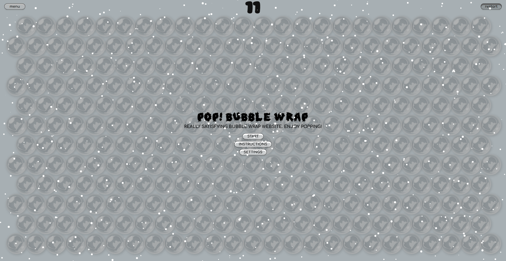

# Bubble Wrap

Bubble Wrap is a fun and interactive web application that simulates the satisfying experience of popping bubble wrap. Enjoy the realistic popping sounds and visual feedback as you click through endless sheets of virtual bubble wrap.
```
+----------------------------------------------------------------+
|                                                                |
|   ____        _     _     _       __        __                 |
|  | __ ) _   _| |__ | |__ | | ___  \ \      / / __ __ _ _ __    |
|  |  _ \| | | | '_ \| '_ \| |/ _ \  \ \ /\ / / '__/ _` | '_ \   |
|  | |_) | |_| | |_) | |_) | |  __/   \ V  V /| | | (_| | |_) |  |
|  |____/ \__,_|_.__/|_.__/|_|\___|    \_/\_/ |_|  \__,_| .__/   |
|                                                       |_|      |
|                                                adnans.website  |
+----------------------------------------------------------------+
```
Preview:


---

## Features

- Realistic Bubble Popping: Click on bubbles to pop them with satisfying sound effects.  
- Customizable Experience: Adjust bubble size, color, and sound volume.  
- Score Tracking: Keep track of how many bubbles you've popped.  
- Responsive Design: Works on both desktop and mobile devices.  
- Particle Effects: Beautiful background animation powered by [particles.js](https://github.com/VincentGarreau/particles.js/).  
- Persistent Settings: Your preferences are saved between sessions.  
- Multiple Sheets: New bubble sheets automatically generate when all bubbles are popped.

---

## 📦 Installation

1. **Download** or **clone** the repository:
   ```bash
   git clone https://github.com/adddeveloper/wrapping-bubble.git
